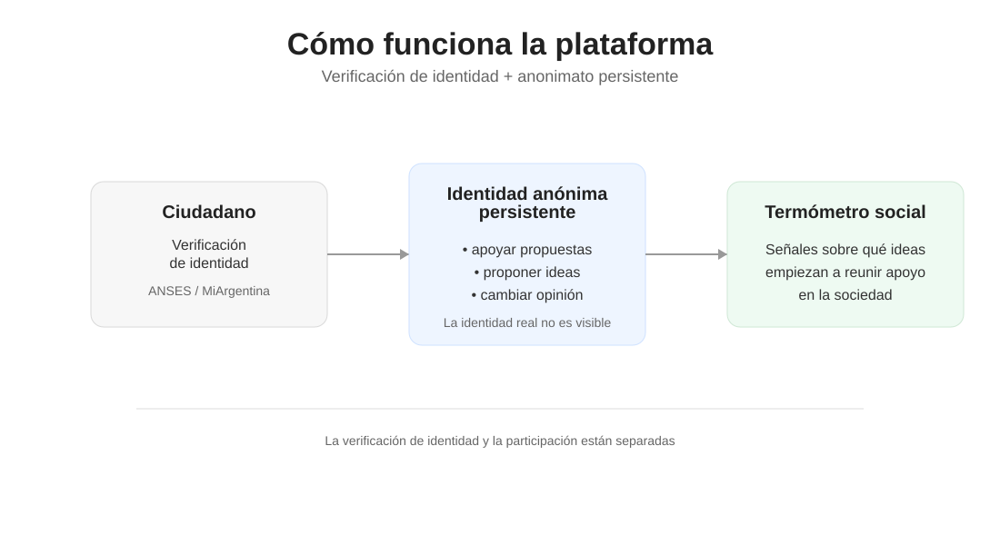

# 00 — Resumen Ejecutivo

## Una idea simple

Las democracias modernas tienen millones de voces, pero muy pocas herramientas para escuchar qué está pensando realmente la sociedad entre elecciones.

El ciudadano común participa políticamente de manera directa solo cada varios años, cuando vota en una elección. Entre esos momentos, la capacidad de expresar prioridades, preocupaciones o ideas de forma estructurada es limitada.

Las redes sociales amplifican algunas opiniones, pero también introducen ruido, polarización y dinámicas de exposición pública que muchas personas prefieren evitar. Las encuestas, por su parte, capturan fotografías momentáneas, pero no permiten observar cómo evolucionan las ideas dentro de la sociedad a lo largo del tiempo.

Este documento explora una pregunta sencilla:

**¿Sería posible crear una herramienta digital que permita escuchar a la sociedad de forma continua, sin exponer públicamente a las personas y sin abrir la puerta a trolls, bots o manipulación mediante cuentas múltiples?**

## La propuesta

La idea central es una **Plataforma de Participación Ciudadana Digital con Identidad Anónima**.

El sistema combina dos elementos que normalmente aparecen separados:

- verificación de identidad  
- anonimato persistente  

Antes de participar, cada ciudadano verifica su identidad utilizando mecanismos existentes (por ejemplo, sistemas de identidad digital del Estado como ANSES, AFIP/ARCA, MiArgentina).

Una vez verificada, la persona recibe una **identidad anónima persistente** dentro de la plataforma.

Esa identidad funciona como su identidad pública dentro del sistema: permite participar, proponer ideas y expresar apoyo a propuestas, pero no revela quién es la persona detrás.

De esta manera:

- cada ciudadano puede participar  
- cada persona tiene una sola identidad dentro del sistema  
- las opiniones se expresan sin exposición pública  

El resultado es una identidad que es simultáneamente:

- única  
- anónima  
- persistente  

## Qué permite este sistema

Con este mecanismo, la plataforma podría permitir a los ciudadanos:

- apoyar propuestas existentes  
- proponer nuevas ideas  
- observar qué iniciativas comienzan a reunir apoyo dentro de la sociedad  

A diferencia de un sistema de votación tradicional, el objetivo no es tomar decisiones vinculantes ni reemplazar las instituciones existentes.

La plataforma funcionaría más bien como un **termómetro social permanente**: una herramienta para detectar preocupaciones emergentes, observar tendencias de opinión y comprender mejor qué temas empiezan a reunir apoyo ciudadano.

Esto podría resultar útil para:

- legisladores  
- gobiernos  
- organismos públicos  
- investigadores sociales  

## Esquema general del sistema

El siguiente diagrama resume de forma simplificada cómo funciona la plataforma.

## Qué problema intenta resolver

La propuesta intenta abordar un dilema que aparece una y otra vez en la participación política digital.

Si el sistema es completamente anónimo, suele degradarse rápidamente: aparecen trolls, spam, campañas coordinadas y cuentas múltiples.

Si el sistema utiliza identidad real, ocurre lo contrario: muchas personas prefieren no participar por miedo a represalias laborales, sociales o mediáticas.

El resultado suele ser un espacio dominado por minorías muy activas o por usuarios dispuestos a exponerse públicamente.

La idea explorada en estos documentos intenta resolver ese dilema mediante un modelo de **identidad verificada con anonimato persistente**.

## Alcances y límites

Es importante subrayar que esta propuesta **no pretende reemplazar la democracia representativa**, ni crear un sistema de votación directa sobre políticas públicas.

La plataforma se concibe como una herramienta de observación social, no como un mecanismo de decisión vinculante.

Las instituciones políticas continuarían siendo las responsables de debatir, legislar y gobernar. La plataforma simplemente ofrecería una señal adicional sobre qué temas comienzan a preocupar o interesar a la sociedad.

Como cualquier sistema digital, también presenta desafíos y riesgos: protección del anonimato, prevención de manipulación, arquitectura técnica adecuada y mecanismos de auditoría.

Los documentos técnicos incluidos en esta propuesta exploran cómo podrían abordarse estos desafíos utilizando tecnologías disponibles actualmente.

## Una exploración conceptual

La propuesta presentada en estos documentos no introduce una nueva tecnología criptográfica ni un nuevo protocolo de votación.

Su aporte principal consiste en integrar tecnologías existentes —identidad digital, sistemas de participación online y técnicas de preservación de anonimato— para explorar una forma distinta de participación ciudadana digital.

El objetivo de este repositorio no es presentar un producto terminado, sino abrir una conversación sobre una posible herramienta institucional para escuchar a la sociedad de manera más directa, continua y respetuosa de la privacidad.

Las críticas, objeciones y mejoras son bienvenidas.
